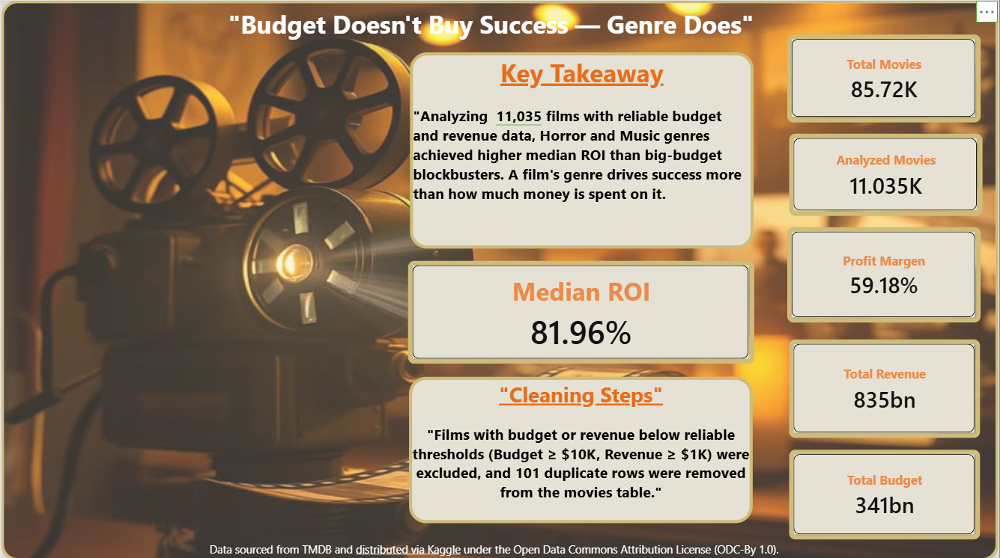
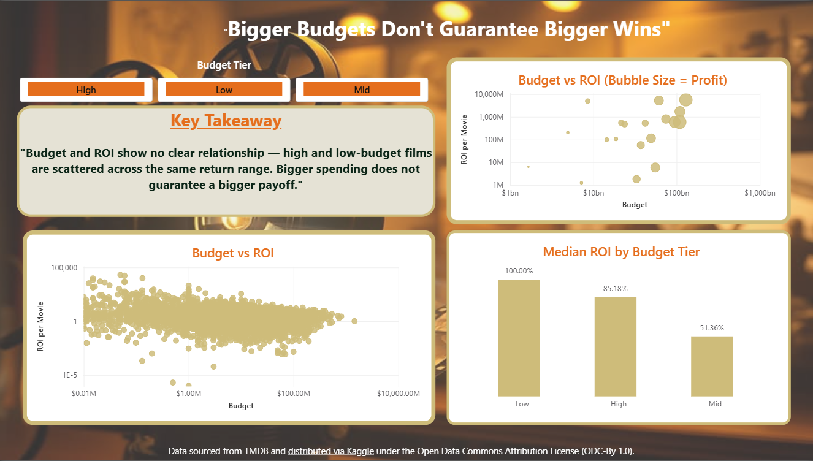
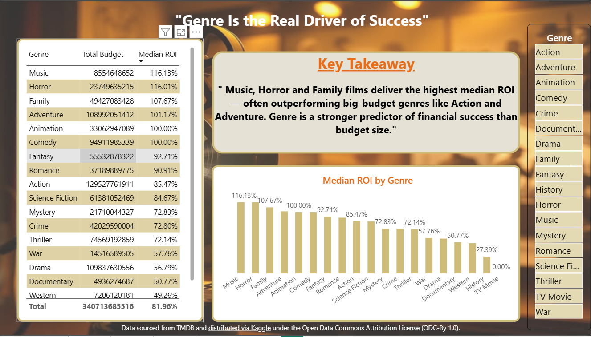
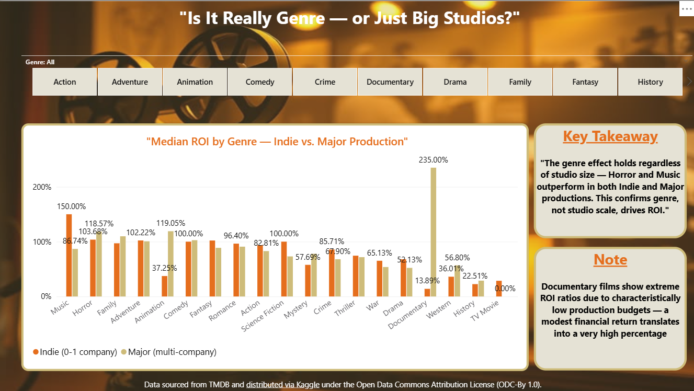
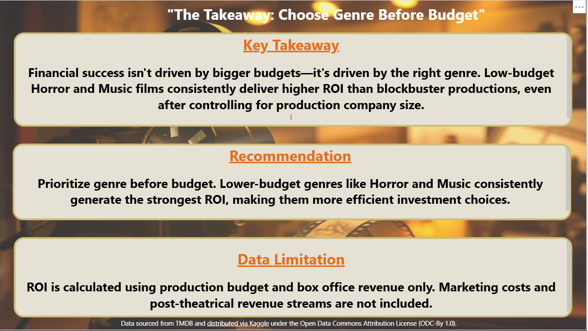

# 🎬 The Genre Effect — A Movie ROI Analysis

**Power BI Data Visualization World Championship — Round 3 (Barcelona '26)**

> Submitted under the title *"Budget Doesn't Buy Success — Genre Does"*

## Overview

What actually drives a movie's financial success? Using a dataset of 85,000+ movies sourced from TMDB, this Power BI report challenges the common assumption that bigger budgets guarantee bigger returns.

**Key finding:** Genre is a stronger predictor of return on investment (ROI) than production budget. Low-budget genres like Horror and Music consistently outperform big-budget blockbusters in median ROI — and this effect holds true even after controlling for production company size.

## 📊 Report Structure (5 pages)

| Page | Title | Purpose |
|---|---|---|
| 1 | Budget Doesn't Buy Success — Genre Does | Introduces the question, key takeaway, and data cleaning methodology |
| 2 | Bigger Budgets Don't Guarantee Bigger Wins | Shows budget vs. ROI has no clear linear relationship |
| 3 | Genre Is the Real Driver of Success | Ranks genres by median ROI |
| 4 | Is It Really Genre — or Just Big Studios? | Stress-tests the genre effect against production company size (Indie vs. Major) |
| 5 | The Takeaway: Choose Genre Before Budget | Summary, recommendation, and data limitations |

## 🖼️ Dashboard Preview

### Page 1 — Overview & Key Takeaway


### Page 2 — Bigger Budgets Don't Guarantee Bigger Wins


### Page 3 — Genre Is the Real Driver of Success


### Page 4 — Is It Really Genre — or Just Big Studios?


### Page 5 — The Takeaway


## 🧹 Methodology

### Data Cleaning
- Removed 101 duplicate rows (same `Movie ID`) from the raw `Movies` table
- Removed duplicate `Movie ID` + `Genre ID` combinations from the `Genre Bridge` table
- Filtered to films with realistic financial data: `Budget ≥ $10,000` and `Revenue ≥ $1,000`, excluding placeholder/invalid entries (e.g., $1 budgets)
- Final analysis sample: **11,035 films** out of 85,394 total records

### Metric Definition
Success is defined as **Median ROI** per film:
```
ROI = (Revenue − Budget) ÷ Budget
```
Median (not average or sum) was used throughout to avoid distortion from outlier films and large-scale blockbusters.

### Stress Test
To rule out production scale as a confounding factor, genres were compared across two groups:
- **Indie** — films with 0–1 production company
- **Major** — films with 2+ production companies (co-productions)

The genre effect (Horror, Music, Family outperforming) held in both groups.

## ⚠️ Data Limitations

- ROI is calculated from **theatrical revenue and production budget only** — marketing costs and post-theatrical revenue (streaming, merchandising, home video) are not included in the source dataset.
- Documentary genre shows unusually high ROI ratios due to characteristically low production budgets — a modest financial return translates into a very high percentage. This figure is more sensitive to a small number of high-performing titles than other genres.

## 📁 Data Source

Movie data sourced from **TMDB** and distributed via **Kaggle** under the [Open Data Commons Attribution License (ODC-By 1.0)](https://opendatacommons.org/licenses/by/1-0/).

## 🛠️ Tools

- Power BI Desktop
- Power Query (data cleaning)
- DAX (ROI, Budget Tier, Company Type measures and calculated columns)


---

*Submitted as part of the Microsoft Fabric Community World Championship, Preliminary Round 3.*
